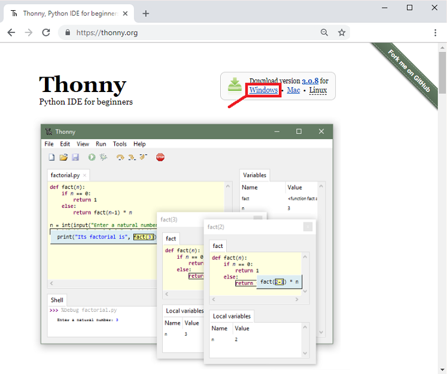
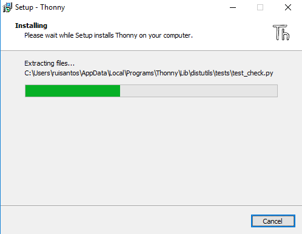
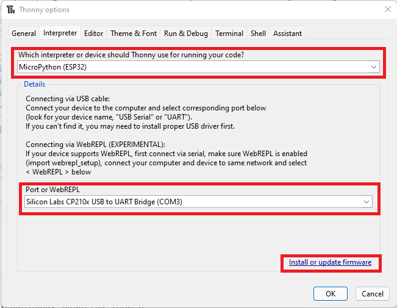
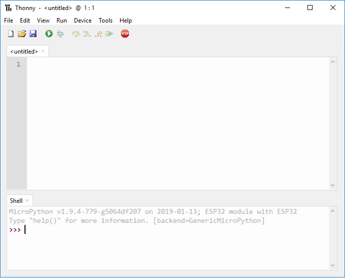
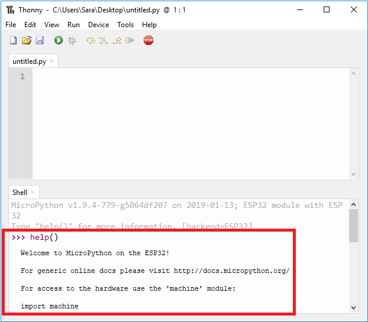
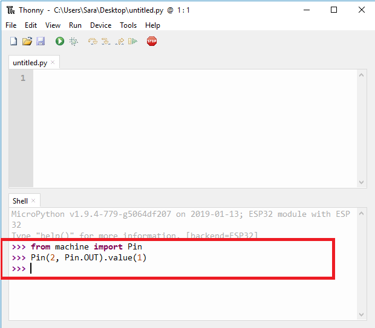

# Installatie van Thonny

Om de Thonny IDE te installeren ga je naar de website:

[https://thonny.org](https://thonny.org)

Klik op Windows (1) zoals in volgende figuur.

Voer de gedowloade .exe file uit.

Volg de installatie wizard om het installatieproces te vervolledigen. Klik Next.

Na het vervolledigen van de installatie, open Thonny IDE. Het volgende window komt te voorschijn.

## Installatie van MicroPython op de ESP32

Er zijn verschillende manieren om de MicroPython Firmware te flashen op de ESP32. Normaal kan dit direct via de Thonny IDE gebeuren. 

Verbind de ESP32 microcontroller met een USB kabel aan de computer (waar Thonny IDE op geïnstalleerd staat).

Start of open Thonny IDE op de computer. En kies binnen het menu van Thonny op **Tools > Options > Interpreter**.

Selecteer de interpreter en let erop dat de PORT de juiste driver bezit. Het zou kunnen dat uw computer die driver niet bezit, dan moet je die eerst zoeken en downloaden van het internet. Je kan via configuratiescherm van uw computer de hardware opvragen en controleren of er PORTS en LPT een COM-poort is geselecteerd voor de ESP32. Indien niet, update dan via die driver het onbekende apparaat en een COM-poort zou moeten ter beschikking komen.

Kies daarna voor de juiste interpreter ESP32 en de juiste COM-poort.

Klik op Install or update firmware. Dit kan een tijdje in beslag nemen.

Nu is de ESP32 klaar om Python scripts uit te voeren. Dit kan gecontrolleerd worden door de Shell te bekijken.

In de Shell kunnen er MicroPython code onmiddelijk worden uitgevoerd. Bijvoorbeeld door **help()** te typen.

Als er een reponse komt, dan is alles ok. Een LED (onboard) aansturen kan door (Let wel op de Feather zit de onboard LED op PIN13!, vervang dus 2 door 13.):

De LED kan worden gedoofd door hetzelfde uit te voeren maar een 0 in te geven bij value.

***
