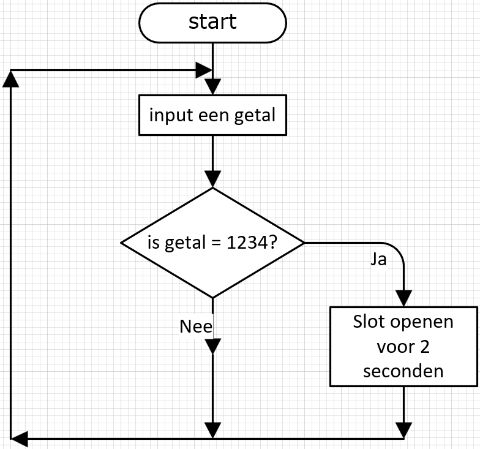
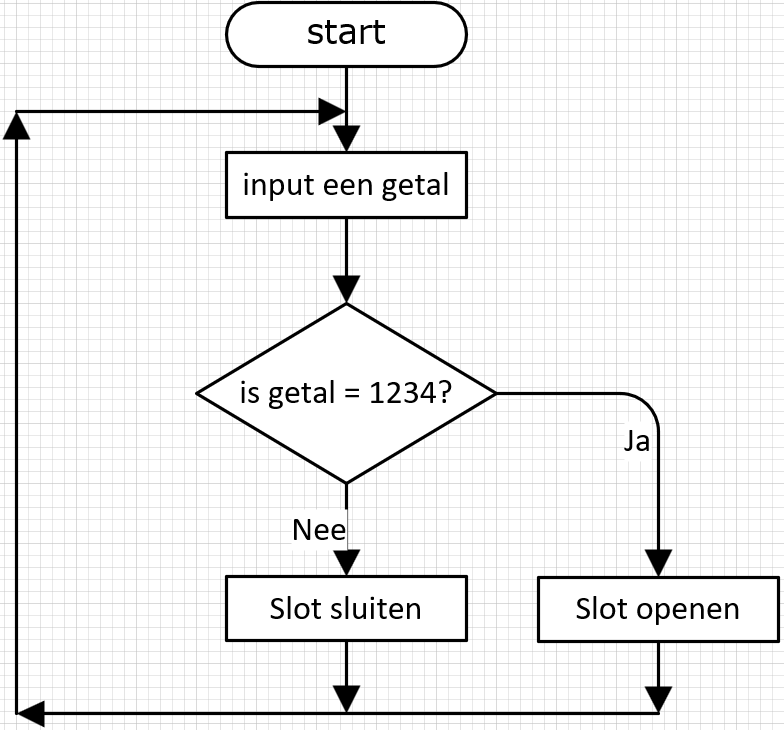
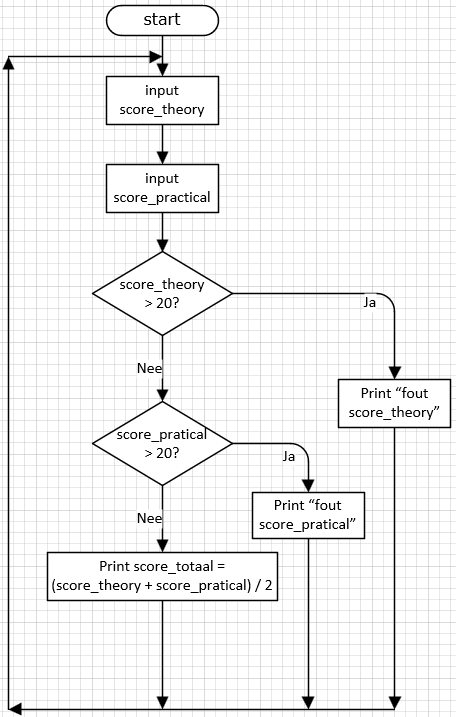
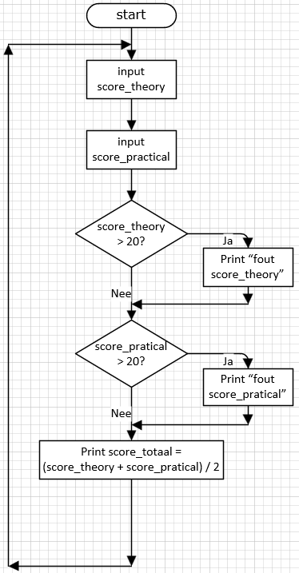

---
mathjax:
  presets: '\def\lr#1#2#3{\left#1#2\right#3}'
---


# Cursus: python voor MicroPython

---

## Inleiding

Deze cursus is ontworpen om beginners kennis te laten maken met de basisprincipes van programmeren in python voor de MicroPython-microcontroller. De cursus begint met de basisconcepten van programmeren en gaat verder met meer geavanceerde technieken. Aan het einde van de cursus zul je in staat zijn om je eigen projecten te ontwikkelen en de MicroPython-microcontroller effectief te gebruiken.

---

## 1: Introductie tot python


### 1.1 Variabelen en Datatypes
- **Wat is een variabele?**
  - Een variabele is een opslagplaats in het geheugen van de processor waarin je gegevens kunt opslaan die je programma gebruikt of bewerkt. Bijvoorbeeld: het opslaan van een getal dat een sensorwaarde vertegenwoordigt.
- **Soorten variabelen:**
  - `int`: Geheel getal, bijvoorbeeld `ledPin = 13`
  - `float`: Kommagetal, bijvoorbeeld `temperatuur = 23.5`
  - `char`: Enkel karakter, bijvoorbeeld `letter = 'A'`
  - `boolean`: Waar of niet waar (true of false), bijvoorbeeld `isAan = true`
  - `string`: Is een lijst (array) van char's `school = 'VIVES'`

### 1.2 Operators
- **Toewijzingsoperator (`=`):** Gebruikt om een waarde toe te wijzen aan een variabele, bijvoorbeeld `x = 10`
- **Wiskundige operators:** Optellen (`+`), aftrekken (`-`), vermenigvuldigen (`*`), delen (`/`), bijvoorbeeld `resultaat = 5 + 3`
- **Vergelijkingsoperators:** Groter dan (`>`), kleiner dan (`<`), gelijk aan (`==`), bijvoorbeeld `if (x > 5)`

---

## 2: Werken met Invoer en Uitvoer

### 2.1 Digitaal en Analoog Invoer/Output
- Verschil tussen digitale en analoge signalen
- Digitaal lezen en schrijven (`Pin.value()` en `Pin.value(True/False)`)
- Analoog lezen en schrijven (`adc.read()` en `dac.write(INTEGER)`)


---

## 3: Control Structures, Selecties en Iteraties

### 3.1 Control Structures

**Selecties (Voorwaardelijke logica)**

De **`if`-conditie:** is een van de belangrijkste onderdelen in elke programmeertaal. In MicroPython (en standaard Python) gebruik je **`if`** om beslissingen te maken in je code. Hieronder bespreken we de verschillende vormen van de **`if`-conditie:** met voorbeelden die je op een ESP32 met MicroPython kunt gebruiken.

- **`if`-statement:**
  - Een `if`-statement voert code uit als een bepaalde voorwaarde waar is. Bijvoorbeeld:
    ```python
    if (temperatuur > 25):
        print("Het is warm!")
        Pin.value(HIGH) # Zet LED aan als temperatuur groter is dan 25 graden
    ```
> :bulb: **Uitleg:**    
> Als de temperatuur groter is dan 25, zal de ESP32 "Het is warm!" printen in de seriële console en een pin digitaal HOOG zetten.


- **`if` en `else`:**
  - Gebruik `if` en `else` om alternatieve acties te definiëren als de eerste voorwaarde niet waar is.
    ```python
    if (temperatuur > 25):
        Pin.value(HIGH)
    else:
        Pin.value(LOW)
    
    ```


- **`if` - `elif` - `else`:** 
  - Met `elif` kun je meerdere condities controleren.
  
```python
    temperatuur = 22

  if temperatuur > 30:
    print("Hittegolf!")
  elif temperatuur > 20:
    print("Lekker weer.")
  else:
    print("Neem een jas mee.")
  
```
- **Geneste `if`-condities**
  - Een `if`-conditie binnenin een andere `if`.
  
```python
  temperatuur = 28
  luchtvochtigheid = 85

  if temperatuur > 25:
    if luchtvochtigheid > 80:
        print("Benauwd weer.")
    else:
        print("Warm maar droog.")

```
- **`if` met logische operatoren (`and`, `or`, `not`)**
  - `and` – beide condities moeten waar zijn:
```python
  temperatuur = 28
  luchtvochtigheid = 60

  if temperatuur > 25 and luchtvochtigheid < 70:
    print("Perfect weer!")

```
  - `or` – minstens één conditie moet waar zijn:

```python
  beweging = True
  lichtniveau = 10  # laag

  if beweging or lichtniveau < 20:
    print("Lamp aan.")

```
  - `not` – keert een conditie om:
```python
  knop_ingedrukt = False

  if not knop_ingedrukt:
    print("Wachten op knop...")

```

**Flowcharts (grafische weergave selecties)**
Omdat logische digitale selecties behoorlijk complex kunnen zijn bestaan er grafische hulmiddelen om die te verduidelijken. Deze kunnen zeker ook helpen tijdens de ontwerpfase. In principe kan iedereen deze begrijpen ook zonder programmeerervaring. 

Flowcharts berusten op enkele eenvoudige grafische vormen die aan elkaar worden getekend en die de FLOW van de selecties die moeten gebeuren in code, verduidelijken.

Hier wordt vereenvoudigd gewerkt met enkele simpele figuren zoals:
- Een afgeronde rechthoek : betekent de start of stop van code.
- Een rechthoek is een statement, een instructie, een handeling, een activiteit.
- Een ruitvorm of diamand is een selectie. Daar komt een vraag in te staan waarop het antwoord Ja of Nee kan zijn. Dit zijn dan ook twee verschillende uitgangswegen. Er is 1 toegangsweg die bovenaan staat.

Enkele voorbeelden met telkens enkele vragen die door de lezer dienen opgelost te worden.
- **`if`-statement:**


<div style="background-color:darkgreen; text-align:left; vertical-align:left; padding:15px;">
<p style="color:lightgreen; margin:10px">
Opdracht: Los volgende vragen op ivm de if-selectie:
<ul style="color: white;">
<li>Wat gebeurt er als juist getal wordt ingegeven?</li>
<li>Wat gebeurt er als foutief getal wordt ingegeven?</li>
<li>Hoeveel herkansingen zijn er?</li>
<li>Hoelang blijft het slot open na het openen?</li>
<li>Hoe wordt de selectie in code gerealiseerd?</li>
<li>Hoe worden die herkansingen (repetitiviteit) in code gerealiseerd?</li>
<li>Is er ooit een einde aan dit programma?</li>
<li>Als in het statement van het openen de instructie zou zijn: “<b>Slot openen</b>” (dus zonder tijd), wat zou het gevolg hiervan zijn?</li>
<li>Wat zou het gevolg zijn als er geen terug LOOP zou zijn, geen pijl terug naar boven?</li>
<li>Hoe zou je vorige vraag dan in code programmeren?</li>
<li>In de selectie wordt een vergelijking uitgevoerd, in het voorbeeld: “=” of “isgelijkaan”. Welke vergelijkingen bestaan er nog zoal? Som ze allemaal op.</li>
<li>Hoe wordt een is “=” of “isgelijkaan” in code geprogrammeerd?</li>
</ul>
</p>
</div>

- **`if` en `else`:**


<div style="background-color:darkgreen; text-align:left; vertical-align:left; padding:15px;">
<p style="color:lightgreen; margin:10px">
Opdracht: Los volgende vragen op ivm de if_else-selectie:
<ul style="color: white;">
<li>Wat gebeurt er als juist getal wordt ingegeven?</li>
<li>Wat gebeurt er als foutief getal wordt ingegeven?</li>
<li>Hoeveel herkansingen zijn er?</li>
<li>Hoelang blijft het slot open na het openen?</li>
<li>Hoe wordt de selectie in code gerealiseerd?</li>
<li>Hoe worden die herkansingen (repetitiviteit) in code gerealiseerd?</li>
<li>Is er ooit een einde aan dit programma?</li>
<li>Wat zou het effect zijn als de code in de JA-tak zou zijn: “<b>Slot openen voor 2 seconden</b>”?</li>
</ul>
</p>
</div>

- **`if` - `elif` - `else`:** 



<div style="background-color:darkgreen; text-align:left; vertical-align:left; padding:15px;">
<p style="color:lightgreen; margin:10px">
Opdracht: Los volgende vragen op ivm de elif-selectie:
<ul style="color: white;">
<li>Wat gebeurt er bij:</li>
<ul style="color: white;">
<li>score_theory = 25 en score_pratical = 32</li>
<li>score_theory = 10 en score_pratical = 32</li>
<li>score_theory = 25 en score_pratical = 15</li>
<li>score_theory = 10 en score_pratical = 15</li>
</ul>

<li>Schrijf code met twee afzonderlijke IF-statements</li>
<li>Schrijf code met ELIF-statement</li>

</ul>
</p>
</div>



<div style="background-color:darkgreen; text-align:left; vertical-align:left; padding:15px;">
<p style="color:lightgreen; margin:10px">
Opdracht: Los volgende vragen op ivm de elif-selectie:
<ul style="color: white;">
<li>Wat gebeurt er bij:</li>
<ul style="color: white;">
<li>score_theory = 25 en score_pratical = 32</li>
<li>score_theory = 10 en score_pratical = 32</li>
<li>score_theory = 25 en score_pratical = 15</li>
<li>score_theory = 10 en score_pratical = 15</li>
</ul>

<li>Schrijf code met twee afzonderlijke IF-statements.</li>
<li>Wat is uw conclusie van deze code?</li>

</ul>
</p>
</div>

### 3.2 Iteraties (Lussen)
- **`for`-lus:**
  - Wordt gebruikt om een blok code meerdere keren uit te voeren, met een controle over het aantal herhalingen. Bijvoorbeeld:
    ```python
    for x in range(10):
        Pin.value(HIGH)
        sleep(0.5)
        Pin.value(LOW)
        sleep(0.5)    
    ```
- **`while`-lus:**
  - Voert code uit zolang een bepaalde voorwaarde waar is. Bijvoorbeeld:
    ```python
    while (Pin_drukknop.value() == LOW):
        Pin_LED.value(HIGH)
    Pin_LED.value(LOW)
    ```

### 3.3 Functies
- **Wat zijn functies en waarom gebruiken we ze?**
  - Functies zijn herbruikbare blokken code die een specifieke taak uitvoeren. Ze maken je code overzichtelijker en makkelijker te onderhouden.
- **Functies definiëren en oproepen:**
  - Een eenvoudige functie:
    ```python
    def zetLEDaan():
        Pin.value(HIGH)
    
    ```

- **Overdracht van parameters en het teruggeven van waarden:**
  - Een functie met parameters:
    ```python
    def knipperLED(aantalkeer): 
        for x in range(aantalkeer):
          Pin.value(HIGH)
          sleep(0.5)
          Pin.value(LOW)
          sleep(0.5)    
        
    
    ```
  - Een functie met parameters en teruggeef waarde:
    ```python
    def optelling(getal1, getal2): 
        som=getal1+getal2
        return (som) 
        
    
    ```

---

Deze cursus biedt een basis om door te stromen naar meer geavanceerde projecten en om de vaardigheden die je leert toe te passen in de echte wereld. 
