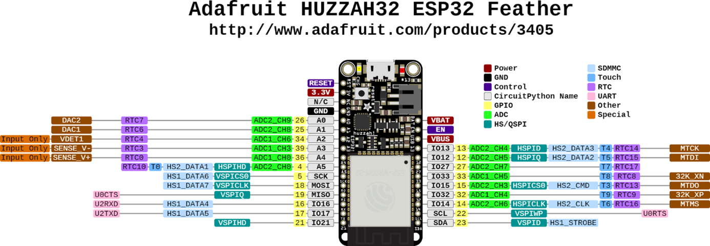
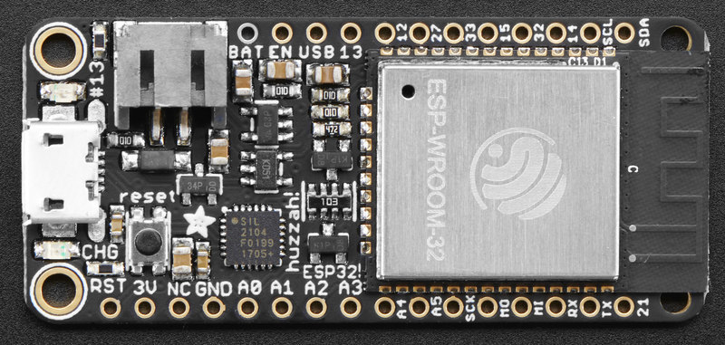
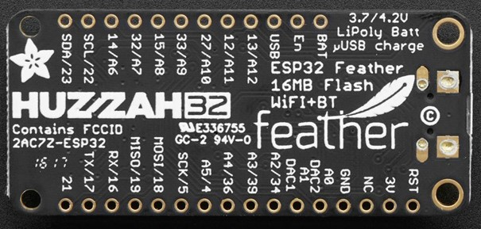
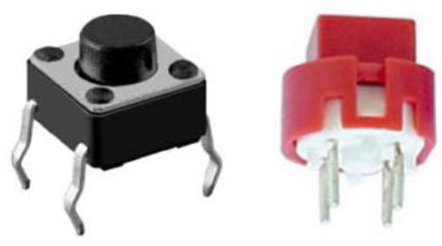
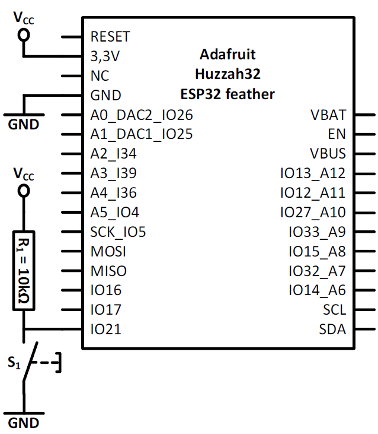
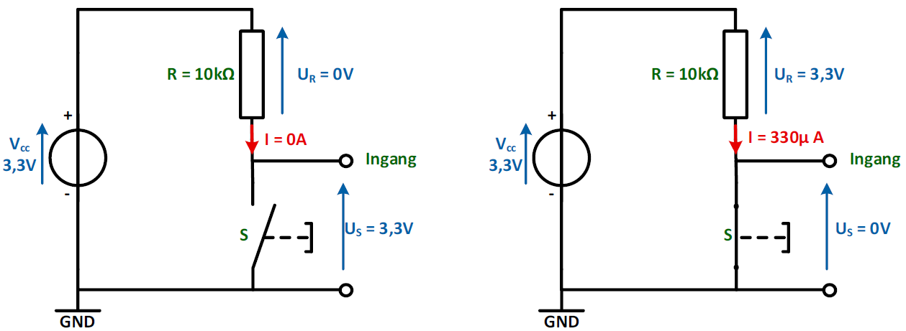
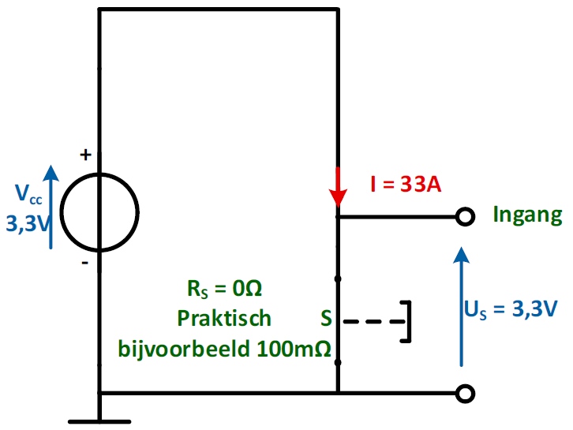
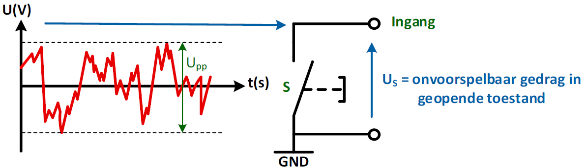
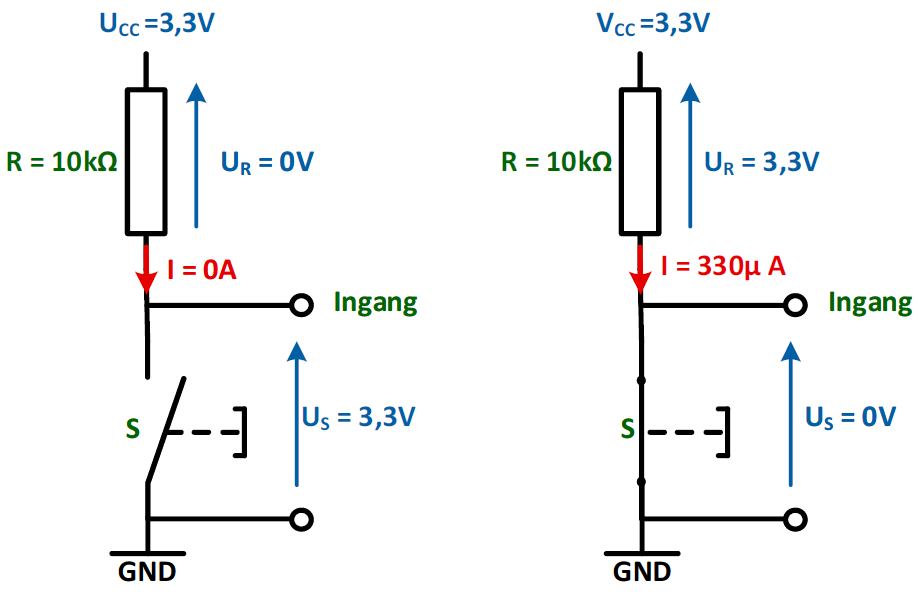
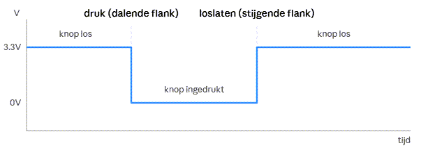

---
mathjax:
  presets: '\def\lr#1#2#3{\left#1#2\right#3}'
---

# GPIO: Input

De ESP32 bezit dus een aantal GPIO (General Purpose Input Output) pinnen. Deze pinnen kunnen gebruikt worden als digitale in- of output. Bij een input kan een digitale toestand (0 of 1) worden gelezen door de microcontroller. 


> - Een ingang zal gebruikt worden om door de microcontroller te worden gelezen, hierop zal dus één of andere vorm van sensor of detector worden aangesloten. Meest eenvoudige vorm van zoiets is een drukknop.
> - Een uitgang zal gebruikt worden om door de microcontroller te worden aangestuurd, hierop zal dus één of andere vorm van actuator worden aangesloten. Meest eenvoudige vorm van zoiets is een LED.

## Digitale ingangen

> - Een logische 0 wordt op een digitale input gelezen als er op die pin een spanning wordt aangeboden van 0V.
> - Een logische 1 wordt op een digitale input gelezen als er op die pin een spanning wordt aangeboden van 3,3V (= voedingsspanning van de microcontroller)

De ESP32 gebruikt een voedingsspanning van 3,3V waarbij 0V overeenkomt met ‘off’ (=uit) en 3,3V staat voor ‘on’ (=aan).

In digitale systemen worden een aantal termen door elkaar gebruikt om te zeggen dat een toestel aan of uit staat. Deze verschillende termen worden weergegeven in volgende tabel.


| 0V | 3,3V |
| ----------- |:------------:|
| Open        | Closed    | 
| Off    | On           | 
| Low  | High   |
| Clear  | Set   |
| Logic 0  | Logic 1   |
| False  | True  |

De termen ‘logisch 0’ en ‘logisch 1’ worden meestal afgekort naar ‘0’ en ‘1’.








Enkel de pinnen met de gele labels kunnen als digitale ingangen gebruikt worden. De pin 12 is niet aan te raden om te gebruiken als ingang, omdat deze standaard is voorzien van een pull-down weerstand en deze mag bij het booten (=opstarten) niet beïnvloed worden. Het maximum aantal is dus 20.

## Aansluiten van sensoren (bv drukknoppen) met een pullup weerstand

Aan een digitale ingang kunnen we detectoren aansluiten die aan de microcontroller doorgeven of er een spanning aanwezig is of niet.
Een voorbeeld van een detector die een digitale waarde geeft is een drukknop.



De eenvoudigste hardware detector die kan gebruikt worden om een digitale input aan te sturen is een drukknop. Bedienen kan door het indrukken of het loslaten van de drukknop. Een drukknop is geen schakelaar. Een schakelaar kent twee rusttoestanden, een drukknop slechts één.

Een drukknop werkt op het principe van het 'maken van een contact' of 'het verbreken van een contact tussen twee aansluitpunten. Soms spreekt men van een NO-contact of een NC-contact. Meestal wordt als drukknop een NO-contact gebruikt. Bij het drukken worden een verbinding gemaakt, bij loslaten wordt een verbinding verbroken, tussen twee aansluitpunten.

Het schema om een drukknop aan te sluiten aan een microcontroller met een pull-up weerstand is weergegeven in de volgende figuur.



Als je naar het schema kijkt wordt er niet alleen een drukknop gebruikt maar ook een weerstand.
Deze weerstand noemt een pull-up weerstand omdat hij de ingang aan de voedingsspanning hangt als de drukknop niet is ingedrukt. Bij het indrukken wordt de ingang aan de GND verbonden.

## Werking van het schema.

De drukknop heeft twee toestanden. Als hij niet ingedrukt is leest de ingang een hoge spanning. Linkse afbeelding de volgende figuur. De microcontroller zal dit zien als een logische 1 of true.

$I = 0 A$

Als de knop ingedrukt is leest de ingang een lage spanning. Rechtse afbeelding in de volgende figuur.
De microcontroller zal dit zien als een logische 0 of false.

$I = \frac{U_R} {R} = \frac{3,3V} {10k\Omega}=0,033mA = 330\mu A$

Dit is een digitale detector omdat de drukknop maar twee toestanden kan weergeven, namelijk ingedrukt, uit, laag of 0. De andere toestand is niet ingedrukt, aan, hoog of 1.



De reden voor de weerstand R is om geen kortsluiting te veroorzaken als de drukknop gesloten is. Als de weerstand er niet zou zijn en de schakelaar is gesloten dan hebben we de schakeling van volgende figuur.



$I = \frac{U_R} {R} = \frac{3,3V} {100m\Omega }=33A$

Zonder weerstand met een gesloten drukknop loopt er een stroom van 33A. 33A is te groot voor de voeding waardoor de voeding defect zal geraken. De draden die de verbinden verzorgen naar de componenten zijn ook veel te dun. Met een stroom van 33A zal de temperatuur van de draden stijgen met als gevolg dat de isolatie en het koper zal smelten.

Een tweede reden waarom er een weerstand gebruikt wordt is omdat in beide schakelstanden de ingang aan een vast potentiaal zal hangen (0V of 3,3V). Een ingang waaraan geen pull-up gebruikt wordt zal in geopende stand een antenne vormen. Dit wil zeggen dat door storingen de microcontroller een hoge of een lage spanning kan zien wat een ongewenst gedrag van de microcontroller als gevolg heeft.



Samengevat krijgen we deze opstellingen met pull-up weerstanden. Uitzonderlijk kunnen ook pull-down weerstanden gebruikt worden.



::: warning
Een pull-up weerstand wordt het meest gebruikt. Het nadeel is dat men een 1 krijgt als de drukknop niet is ingedrukt en een 0 als de drukknop is ingedrukt. Je kan dit zien als een NEGATIEVE LOGICA of een ACTIEF LAGE manier om een drukknop te gebruiken.
:::


## pinMode

Als men een IO-pin als ingang wil gebruiken moet men de pinMode van de IO-pin instellen als ingang zoals in vorige figuren. Het is het gemakkelijkst om hier de gele pinbenaming te gebruiken.
De pinMode van de IO-pin stel je in bij opstart van de controller en dit gebeurt in de setup-methode.
Aan de methode pinMode worden er twee parameters meegegeven tussen haakjes. De eerste parameter is de IO-pin waarover het gaat en de tweede parameter is hoe deze ingesteld moet worden, hier is dit als ingang. 

Zie volgend voorbeeld waarbij pin2 als ingang wordt ingesteld en waarbij de toestand van die pin wordt gelezen en wordt doorgestuurd naar de seriële monitor.

```python
from machine import Pin

p0 = Pin(0, Pin.OUT)    # create output pin on GPIO0
p0.on()                 # set pin to "on" (high) level
p0.off()                # set pin to "off" (low) level
p0.value(1)             # set pin to on/high

p2 = Pin(2, Pin.IN)     # create input pin on GPIO2
print(p2.value())       # get value, 0 or 1

```

## De toestand lezen

Als je de toestand van een ingang wil weten, dan kan je de waarde bekomen door gebruik te maken van Pin.value(). Zie vorig voorbeeld.

In volgend voorbeeld wordt een digitale uitgang (LED) aangestuurd met de toestand van een digitale ingang (drukknop)

```python
from machine import Pin

led_onboard = Pin(13, Pin.OUT, value=0)    # create output pin on GPIO13, by start is the pin Low
drukknop = Pin(21, Pin.IN)      # create input pin on GPIO21
while True:
    led_onboard.value(drukknop.value())

```
De toestand van de drukknop wordt gelezen en wordt onmiddelijk toegekend aan de toestand van de digitale uitgang. 

Het zelfde resultaat kan bekomen worden met een selectie-statement in Python. Het statement `IF`. Meer info kan gevonden worden op :[MicroPython](https://et-robotics.netlify.app/arduino_c/)


```python
from machine import Pin

led_onboard = Pin(13, Pin.OUT, value=0)    # create output pin on GPIO13, by start is the pin Low
drukknop = Pin(21, Pin.IN)      # create input pin on GPIO21
while True:                         #herhaal volgend stuk code oneindig lang
    if drukknop.value() == False:   #drukknop ingedrukt?
      led_onboard.value(True)       #Ja => LED aan
    else:                           
      led_onboard.value(False)      #Nee => LED uit

```


> :bulb: **Tip:** Wat zijn de bevindingen? Wanneer licht de LED op? Bij het drukken of niet drukken op de drukknop? Welke conclusie kan hier worden getrokken?

::: tip
De ESP32 bezit ook inwendig pull-up en pull-down weerstanden. Deze kunnen geactiveerd worden door pinMode(ingang, INPUT_PULLUP); Dit kan ook met PULLDOWN. Dan moet er uitwendig geen weerstand meer worden geplaatst.
:::

***

::: warning
In de labo's wordt altijd met een externe pullup weerstand gewerkt!!.
:::

***

<div style="background-color:darkgreen; text-align:left; vertical-align:left; padding:15px;">
<p style="color:lightgreen; margin:10px">
Opdracht: Digitale ingang blokgolf. </p>
<ul style="color:white">
<li style="color:white">Als de drukknop niet is ingedrukt moet er een blokgolfspanning op een uitgang gegenereerd worden met een periode van 50Hz met een duty cycle van 50% (Ton = Toff).</li>
<li style="color:white">Als de drukknop is ingedrukt moet er een blokgolfspanning op een uitgang gegenereerd worden met een periode van 100Hz met een duty cycle van 50% (Ton = Toff).</li>
</ul>
<p style="color:lightgreen; margin:10px">
Visualiseer het resultaat met een oscilloscoop. Leg de werking uit van de oscilloscoop. Verklaar duidelijk wat Volt/div en Time/div is op basis van uw signalen. Geef duidelijk aan wat periode(T) is van een signaal. Ook wat frequentie(f) is, waar zit de NUL-VOLT? Wat is de amplitude van het signaal? Zoek op wat duty cycle is en verklaar.
</p>
</div>

***

## Tellen bij een drukknop.

Het spanningsverloop aan de ingangspin ziet er dan als volgt uit:



Dit toont het geïdealiseerde signaal (zonder rekening te houden met contactdender/bounce, wat in de praktijk ook optreedt bij mechanische drukknoppen):

- In rust (knop los): de pin staat hoog (3.3V), omdat de pull-up weerstand de lijn naar boven trekt.
- Bij het indrukken: de knop verbindt de pin met massa, waardoor de spanning naar 0V valt — dit is de dalende flank die de code detecteert (nieuweWaardeSW1 == False en vorigeWaardeSW1 == True).
- Bij het loslaten: de pin gaat terug naar 3.3V — de stijgende flank, die in deze code niet apart afgehandeld wordt.

Dit is precies waarom de code met vorigeWaardeSW1 werkt: door de vorige en de huidige waarde te vergelijken, wordt enkel het moment van overgang (het indrukken) geteld, en niet elke lus-iteratie zolang de knop ingedrukt blijft.

**Werking van de code (uitleg)**

Dit stukje MicroPython telt hoe vaak drukknop sw1 wordt ingedrukt, en steekt LED led1 aan telkens de 10e druk gebeurt.

- nieuweWaardeSW1 leest telkens de huidige stand van de knop.
- vorigeWaardeSW1 onthoudt de stand van de vorige lus-iteratie.
- Door beide te vergelijken, detecteert de code een dalende flank: het moment waarop de knop van niet ingedrukt (True) naar ingedrukt (False) gaat. Dit voorkomt dat één druk op de knop meerdere keren geteld wordt zolang je hem ingedrukt houdt.
- Bij elke gedetecteerde druk wordt teller verhoogd. Bij de 10e keer gaat led1 aan en wordt de teller terug op 0 gezet; anders gaat de LED uit (of blijft ze uit).
- Cruciaal: na elke lus-iteratie, ongeacht of er een druk gedetecteerd werd, moet vorigeWaardeSW1 bijgewerkt worden naar de huidige waarde. Zo is de vergelijking bij de volgende iteratie weer correct.

**Opdracht voor de student**

Opdracht: Onderstaande code zou een drukknoptelling moeten bijhouden en na 10 keer drukken de LED laten oplichten. De code compileert en start op, maar werkt niet correct: na de eerste druk op de knop reageert het programma niet meer op verdere drukken.

Zoek de fout in de code en herstel de werking zodat de teller bij elke druk op de knop correct verhoogt, en de LED effectief aangaat bij de 10e druk.

```python
nieuweWaardeSW1 = True
vorigeWaardeSW1 = True
teller = 0

while True:
    nieuweWaardeSW1 = sw1.value()
    if ((nieuweWaardeSW1 == False) and (vorigeWaardeSW1 == True)):
        teller += 1
        if (teller == 10):
            led1.value(True)
            teller = 0
        else:
            led1.value(False)
        vorigeWaardeSW1 = nieuweWaardeSW1

```

:::tip
kijk goed naar de inspringing (indentation) van de code en denk na over wanneer vorigeWaardeSW1 bijgewerkt moet worden.
:::


<div style="background-color:darkred; text-align:left; vertical-align:left; padding:15px;">
<p style="color:lightgreen; margin:10px">
Opdracht: Digitale ingang tellen. </p>
<ul style="color:white">
<li style="color:white">Maak een systeem waarbij je het aantal keer telt dat de drukknop is ingedrukt.</li>
<li style="color:white">Als de drukknop 10 keer is ingedrukt moet er een led op een uitgang gaan branden.</li>
</ul>
<p style="color:lightgreen; margin:10px">
Bij de elfde keer drukken gaat de LED weer uit en begint alles opnieuw, 10 keer LED 1 keer aan, .... Leg duidelijk uit hoe een flankdetectie werkt en wat dender is!
</p>
</div>


