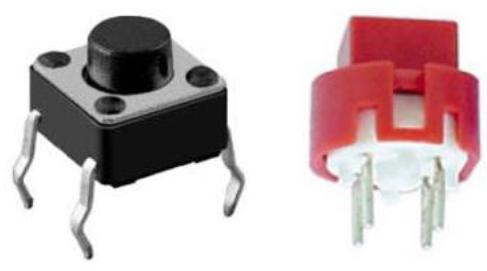
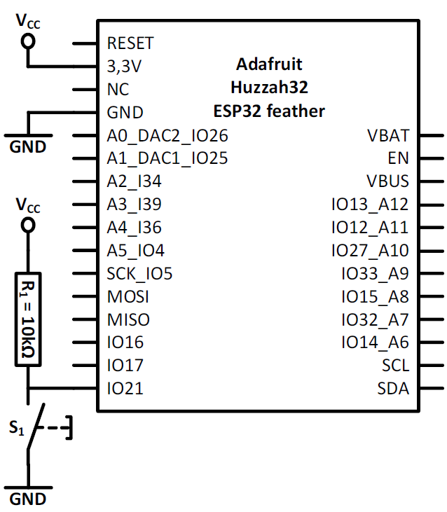

---
mathjax:
  presets: '\def\lr#1#2#3{\left#1#2\right#3}'
---

# GPIO: Input

De ESP32 bezit dus een aantal GPIO (General Purpose Input Output) pinnen. Deze pinnen kunnen gebruikt worden als digitale in- of output. Bij een input kan een digitale toestand (0 of 1) worden gelezen door de microcontroller. 


> - Een ingang zal gebruikt worden om door de microcontroller te worden gelezen, hierop zal dus één of andere vorm van sensor of detector worden aangesloten. Meest eenvoudige vorm van zoiets is een drukknop.
> - Een uitgang zal gebruikt worden om door de microcontroller te worden aangestuurd, hierop zal dus één of andere vorm van actuator worden aangesloten. Meest eenvoudige vorm van zoiets is een LED.

## Digitale ingangen

> - Een logische 0 wordt op een digitale input gelezen als er op die pin een spanning wordt aangeboden van 0V.
> - Een logische 1 wordt op een digitale input gelezen als er op die pin een spanning wordt aangeboden van 3,3V (= voedingsspanning van de microcontroller)

De ESP32 gebruikt een voedingsspanning van 3,3V waarbij 0V overeenkomt met ‘off’ (=uit) en 3,3V staat voor ‘on’ (=aan).

In digitale systemen worden een aantal termen door elkaar gebruikt om te zeggen dat een toestel aan of uit staat. Deze verschillende termen worden weergegeven in volgende tabel.


| 0V | 3,3V |
| ----------- |:------------:|
| Open        | Closed    | 
| Off    | On           | 
| Low  | High   |
| Clear  | Set   |
| Logic 0  | Logic 1   |
| False  | True  |

De termen ‘logisch 0’ en ‘logisch 1’ worden meestal afgekort naar ‘0’ en ‘1’.


Enkel de pinnen met de gele labels kunnen als digitale ingangen gebruikt worden. De pin 12 is niet aan te raden om te gebruiken als ingang, omdat deze standaard is voorzien van een pull-down weerstand en deze mag bij het booten (=opstarten) niet beïnvloed worden. Het maximum aantal is dus 20.

## Aansluiten van sensoren (bv drukknoppen) met een pullup weerstand

Aan een digitale ingang kunnen we detectoren aansluiten die aan de microcontroller doorgeven of er een spanning aanwezig is of niet.
Een voorbeeld van een detector die een digitale waarde geeft is een drukknop.



De eenvoudigste hardware detector die kan gebruikt worden om een digitale input aan te sturen is een drukknop. Bedienen kan door het indrukken of het loslaten van de drukknop. Een drukknop is geen schakelaar. Een schakelaar kent twee rusttoestanden, een drukknop slechts één.

Een drukknop werkt op het principe van het 'maken van een contact' of 'het verbreken van een contact tussen twee aansluitpunten. Soms spreekt men van een NO-contact of een NC-contact. Meestal wordt als drukknop een NO-contact gebruikt. Bij het drukken worden een verbinding gemaakt, bij loslaten wordt een verbinding verbroken, tussen twee aansluitpunten.

Het schema om een drukknop aan te sluiten aan een microcontroller met een pull-up weerstand is weergegeven in de volgende figuur.



Als je naar het schema kijkt wordt er niet alleen een drukknop gebruikt maar ook een weerstand.
Deze weerstand noemt een pull-up weerstand omdat hij de ingang aan de voedingsspanning hangt als de drukknop niet is ingedrukt. Bij het indrukken wordt de ingang aan de GND verbonden.

## Werking van het schema.

De drukknop heeft twee toestanden. Als hij niet ingedrukt is leest de ingang een hoge spanning. Linkse afbeelding de volgende figuur. De microcontroller zal dit zien als een logische 1 of true.

$I = 0 A$

Als de knop ingedrukt is leest de ingang een lage spanning. Rechtse afbeelding in de volgende figuur.
De microcontroller zal dit zien als een logische 0 of false.

$I = \frac{U_R} {R} = \frac{3,3V} {10k\Omega}=0,033mA = 330\mu A$

Dit is een digitale detector omdat de drukknop maar twee toestanden kan weergeven, namelijk ingedrukt, uit, laag of 0. De andere toestand is niet ingedrukt, aan, hoog of 1.


De reden voor de weerstand R is om geen kortsluiting te veroorzaken als de drukknop gesloten is. Als de weerstand er niet zou zijn en de schakelaar is gesloten dan hebben we de schakeling van volgende figuur.


$I = \frac{U_R} {R} = \frac{3,3V} {100m\Omega }=33A$

Zonder weerstand met een gesloten drukknop loopt er een stroom van 33A. 33A is te groot voor de voeding waardoor de voeding defect zal geraken. De draden die de verbinden verzorgen naar de componenten zijn ook veel te dun. Met een stroom van 33A zal de temperatuur van de draden stijgen met als gevolg dat de isolatie en het koper zal smelten.

Een tweede reden waarom er een weerstand gebruikt wordt is omdat in beide schakelstanden de ingang aan een vast potentiaal zal hangen (0V of 3,3V). Een ingang waaraan geen pull-up gebruikt wordt zal in geopende stand een antenne vormen. Dit wil zeggen dat door storingen de microcontroller een hoge of een lage spanning kan zien wat een ongewenst gedrag van de microcontroller als gevolg heeft.


Samengevat krijgen we deze opstellingen met pull-up weerstanden. Uitzonderlijk kunnen ook pull-down weerstanden gebruikt worden.


::: warning
Een pull-up weerstand wordt het meest gebruikt. Het nadeel is dat men een 1 krijgt als de drukknop niet is ingedrukt en een 0 als de drukknop is ingedrukt. Je kan dit zien als een NEGATIEVE LOGICA of een ACTIEF LAGE manier om een drukknop te gebruiken.
:::

## Aansluiten van sensoren (bv drukknoppen) met een pulldown weerstand

Het schema om een drukknop aan te sluiten aan een microcontroller met een pull-down weerstand is weergegeven in de volgende figuur.


Als je naar het schema kijkt wordt er niet alleen een drukknop gebruikt maar ook een weerstand. Deze weerstand noemt een pull-down weerstand omdat hij de ingang aan 0V verbindt als de drukknop niet is ingedrukt.

## pinMode

Als men een IO-pin als ingang wil gebruiken moet men de pinMode van de IO-pin instellen als ingang zoals in vorige figuren. Het is het gemakkelijkst om hier de gele pinbenaming te gebruiken.
De pinMode van de IO-pin stel je in bij opstart van de controller en dit gebeurt in de setup-methode.
Aan de methode pinMode worden er twee parameters meegegeven tussen haakjes. De eerste parameter is de IO-pin waarover het gaat en de tweede parameter is hoe deze ingesteld moet worden, hier is dit als ingang. 

Zie volgend voorbeeld waarbij pin2 als ingang wordt ingesteld en waarbij de toestand van die pin wordt gelezen en wordt doorgestuurd naar de seriële monitor.

```python
from machine import Pin

p0 = Pin(0, Pin.OUT)    # create output pin on GPIO0
p0.on()                 # set pin to "on" (high) level
p0.off()                # set pin to "off" (low) level
p0.value(1)             # set pin to on/high

p2 = Pin(2, Pin.IN)     # create input pin on GPIO2
print(p2.value())       # get value, 0 or 1

```

## De toestand lezen

Als je de toestand van een ingang wil weten, dan kan je de waarde bekomen door gebruik te maken van Pin.value(). Zie vorig voorbeeld.

In volgend voorbeeld wordt een digitale uitgang (LED) aangestuurd met de toestand van een digitale ingang (drukknop)

```python
from machine import Pin

led_onboard = Pin(13, Pin.OUT, value=0)    # create output pin on GPIO13, by start is the pin Low
drukknop = Pin(21, Pin.IN)      # create input pin on GPIO21
while True:
    led_onboard.value(drukknop.value())

```
De toestand van de drukknop wordt gelezen en wordt onmiddelijk toegekend aan de toestand van de digitale uitgang. 

> :bulb: **Tip:** Wat zijn de bevindingen? Wanneer licht de LED op? Bij het drukken of niet drukken op de drukknop? Welke conclusie kan hier worden getrokken?

::: tip
De ESP32 bezit ook inwendig pull-up en pull-down weerstanden. Deze kunnen geactiveerd worden door pinMode(ingang, INPUT_PULLUP); Dit kan ook met PULLDOWN. Dan moet er uitwendig geen weerstand meer worden geplaatst.
:::

***

::: warning
In de labo's wordt altijd met een externe pullup weerstand gewerkt!!.
:::

***

<div style="background-color:darkgreen; text-align:left; vertical-align:left; padding:15px;">
<p style="color:lightgreen; margin:10px">
Opdracht: Digitale ingang blokgolf. </p>
<ul style="color:white">
<li style="color:white">Als de drukknop niet is ingedrukt moet er een blokgolfspanning op een uitgang gegenereerd worden met een periode van 50Hz met een duty cycle van 50% (Ton = Toff).</li>
<li style="color:white">Als de drukknop is ingedrukt moet er een blokgolfspanning op een uitgang gegenereerd worden met een periode van 100Hz met een duty cycle van 50% (Ton = Toff).</li>
</ul>
<p style="color:lightgreen; margin:10px">
Visualiseer het resultaat met een oscilloscoop. Leg de werking uit van de oscilloscoop. Verklaar duidelijk wat Volt/div en Time/div is op basis van uw signalen. Geef duidelijk aan wat periode(T) is van een signaal. Ook wat frequentie(f) is, waar zit de NUL-VOLT? Wat is de amplitude van het signaal? Zoek op wat duty cycle is en verklaar.
</p>
</div>

***

<div style="background-color:darkgreen; text-align:left; vertical-align:left; padding:15px;">
<p style="color:lightgreen; margin:10px">
Opdracht: Digitale ingang tellen. </p>
<ul style="color:white">
<li style="color:white">Maak een systeem waarbij je het aantal keer telt dat de drukknop is ingedrukt.</li>
<li style="color:white">Als de drukknop 10 keer is ingedrukt moet er een led op een uitgang gaan branden.</li>
</ul>
<p style="color:lightgreen; margin:10px">
Bij de elfde keer drukken gaat de LED weer uit en begint alles opnieuw, 10 keer LED 1 keer aan, .... Leg duidelijk uit hoe een flankdetectie werkt en wat dender is!
</p>
</div>


