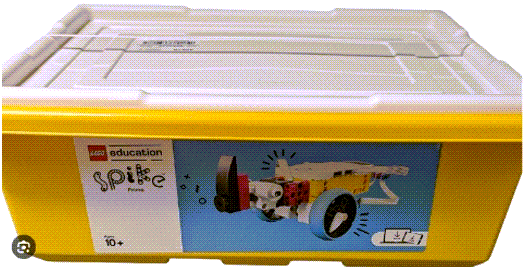
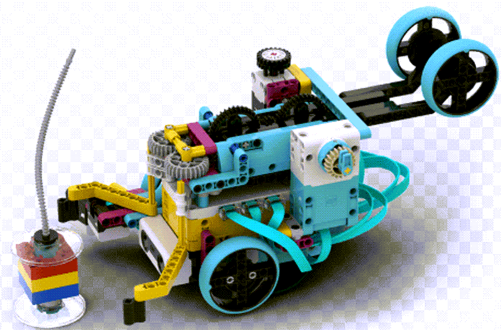

---
mathjax:
  presets: '\def\lr#1#2#3{\left#1#2\right#3}'
---

# LEGO Spike Prime Robot

## Wat

Een LEGO® Education SPIKE™ Prime-robot is een programmeerbare robot die bestaat uit een intelligente hub (microcontroller), motoren, sensoren en LEGO Technic-bouwelementen. De robot kan geprogrammeerd worden met zowel blokken als Python, waardoor hij ideaal is om de stap te zetten van visueel programmeren naar tekstgebaseerd programmeren.

## Waarom

Tijdens de labo-opdrachten wordt de LEGO SPIKE Prime gebruikt om de basisprincipes van Python op een interactieve en praktijkgerichte manier aan te leren. Studenten passen programmeerconcepten zoals variabelen, voorwaarden, lussen, functies en het uitlezen van sensoren onmiddellijk toe op een echte robot. Hierdoor zien ze direct het resultaat van hun programma's, wat het leerproces motiverender maakt en een beter inzicht geeft in de werking van Python en robotica.

## Doel

Verzamel kennis door op papier uw bevindingen te noteren. Als leidraad kan er gebruik gemaakt worden van de vragen in dit document. Verzamel alle antwoorden en eigen bevindingen en verzamel dit papieren document in uw portfolio. Zie Uitdagingen in dit document.

Maak dus een eigen cursus waarmee iemand aan de slag zou kunnen gaan om de LEGO Spike Prime en Python te leren.

## Organisatie

Je werkt per twee. Elk een eigen portfolio, elk een eigen verslag met opdrachten en inhoud.

## Orde

**Zorg voor netheid en orde van de LEGO dozen!!!!!!!!!!!**
