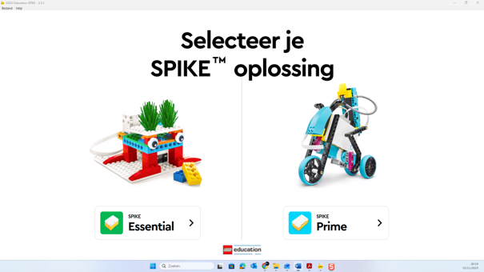
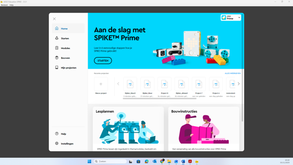
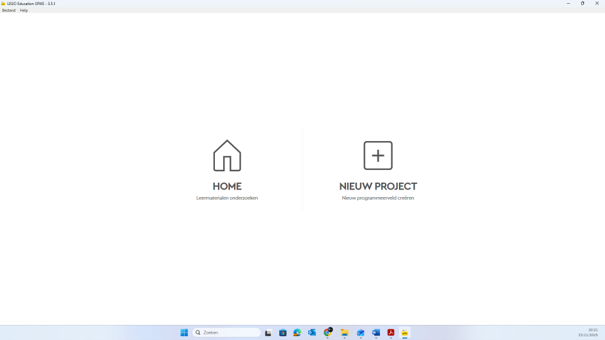
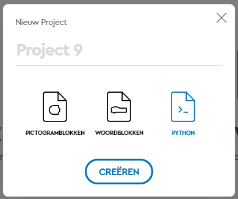
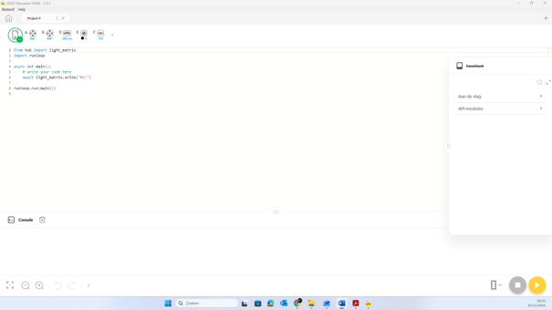

---
mathjax:
  presets: '\def\lr#1#2#3{\left#1#2\right#3}'
---

# LEGO Spike Prime Software

## Installatie software

[LEGO Spike Prime Software](https://education.lego.com/nl-nl/downloads/spike-app/software/)

Start en kies voor **Spike Prime**.

Sluit het intern venster

Kies **NIEUW PROJECT**.

Kies **PYTHON** en klik **CREËREN**

En programmeer en leer uit Kennisbank. Bovenaan zie je de toestand van de sensoren (nadat de HUB is gekoppeld via de USB kabel met de laptop). Onderaan zie je de Console (handig bij Print-commando’s)

Uw verschillende codes kan je opslaan via Bestand : **Opslaan Als ……**

