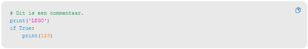
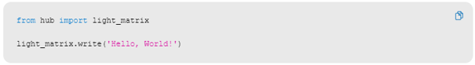
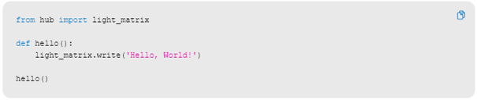
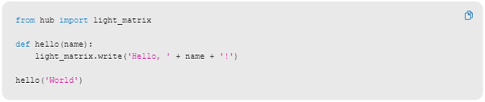

---
mathjax:
  presets: '\def\lr#1#2#3{\left#1#2\right#3}'
---

# Aan de slag

Voer steeds de code eerste uit en bestudeer wat het resultaat is. Wijzig de code zodat je volledig begrijpt wat iedere instructie doet. Verwerk uw bevindingen steeds in uw verslag.

## Eerste code

Wat doet deze code? Hoe werkt ze? Verwerk een wijziging en neem dit steeds op in uw verslag.

## Actuator LED_display

Steeds dezelfde opgave, geef deze code in, bestudeer ze, wat doet de code? Hoe werkt ze? Verwerk een wijziging en neem dit steeds op in uw verslag.

## Function in Python

Zelfde opgave.

## Functie met parameter

Je werkt per twee. Elk een eigen portfolio, elk een eigen verslag met opdrachten en inhoud.

## Uitdaging

***

Opdracht: 

Wijzig de code zo dat de Hub <i>>jou</i>> <b>op naam</b> begroet in plaats van de wereld?

***
