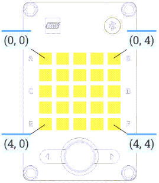
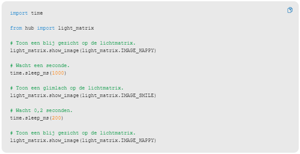

---
mathjax:
  presets: '\def\lr#1#2#3{\left#1#2\right#3}'
---

# Spike licht matrix actuator

## 2 figuurtjes op het display met tussentijd

## Uitdaging

***

Opdracht: 

Maak van vorige een functie zonder parameters en roep die drie keer aan.

***
***

Opdracht: 

Wijzig de code zodat de ogen elke keer als ze knipperen langer open blijven.

***

