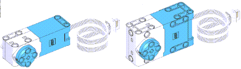
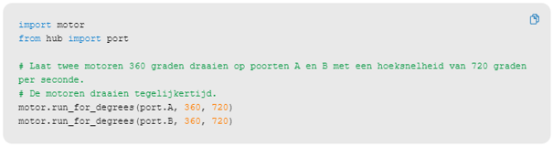

---
mathjax:
  presets: '\def\lr#1#2#3{\left#1#2\right#3}'
---

# Spike motor actuator

Er zijn twee types voorhanden. In de set zitten twee kleine motoren en één grote motor. Qua software kunnen ze gelijkaardig worden behandeld. Beide type bezitten ook een encoder. De motoren zijn dus niet aleen actuatoren, maar ook sensoren (positie bepaling, handige hulp zijn de bolletjes op rotor en stator!!). Zoek zelf eens op hoe een encoder werkt.

## 2 kleine motoren

Wat stel je vast? Wat doen de motoren? Verklaar wijzerzin (clockwise = CW), tegenwijzerzin (counter clockwise = CCW). Wacht de ene motor op de andere? Verklaar de drie parameters die worden meegegeven met de instructie.

## Uitdaging

***

Opdracht: 

Laat de motoren asynchroon tov elkaar draaien (zoek naar de juiste wachttijden (sleep)!!). Asynchroon wil zeggen dat de tweede motor maar pas start met draaien als de eerste motor is gestopt en beëindigd. Dit kan je hier alleen maar doen door gebruik te maken van een wachttijd tussen de twee statements.

***
***

Opdracht: 

Laat de motoren in tegengestelde richting draaien(de ene CW, de andere CCW) en asynchroon.

Doe dit in een oneindige lus.

***

