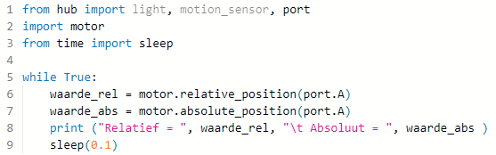

---
mathjax:
  presets: '\def\lr#1#2#3{\left#1#2\right#3}'
---

# Spike encoder sensor

Op de rotoras van de motoren is een encoder gemonteerd die de positie van de rotor kan weergeven. Zoek zelf op het internet hoe zo een encoder werkt. Wordt dit veel toegepast op industriële machines of is dit enkel op speelgoed zoals LEGO interessant?

Op de motoras zit dus steeds een encoder. Die kan je vertellen op welke stand de motor staat. Dit kan absoluut of relatief gebeuren. (zie bolletje op stator en rotor!!). Zoek zelf uit wat dit wil zeggen, absoluut of relatief mbt deze motoren.

## Relatief versus absolute positie

> :bulb: **Opmerking:** Het laatste commando `Sleep` is hier eigenlijk niet nodig, maar het schrijven naar de console (print) verloopt vlotter met een klein beetje wachten.

## Uitdaging

***

Opdracht: 

•	Zoek het verschil tussen absolute- en relatieve positie waarde. Leg uit wat het verschil is (draai zelf aan de as van de motor).

***
