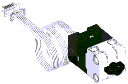
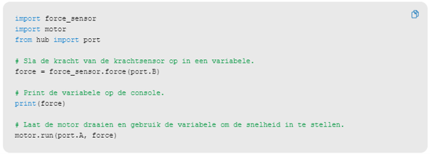

---
mathjax:
  presets: '\def\lr#1#2#3{\left#1#2\right#3}'
---

# Spike kracht sensor

## Waarnemen van een kracht

Met welke eenheid wordt kracht uitgedrukt? Wat is het verschil met massa, welke eenheid is dit? Wat is het verband tussen kracht en massa?

## Uitdaging

***

Opdracht: 

Zorg dat dit en continu proces is, maar zorg in de cyclus voor een korte wachttijd (omdat naar de console iets printen, een beetje tijd nodig is, en de microcontroller in de HUB veel sneller werkt). LET OP: Het meetbereik van de krachtsensor is 0-10N. IS DIT OOK DE WAARDE ALS JE DE FORCE methode aanroept en deze print?????

***
***

Opdracht: 

Stuur een medium motor aan. Wat is de min/max velocity? Regel de snelheid van de motor met de druksensor. Zorg dat max druk overeenkomt met max snelheid, geen druk is stilstand.

***
***

Opdracht: 

Stuur een motor aan en regel de snelheid van de motor met de twee bedieningsknoppen (links – rechts van de powerknop). Telkens je op een knop drukt verhoogt/verlaagt de snelheid van de motor met een vaste stap. Als je blijft de snelheid verlagen tot stilstand en nog verder drukt op verlagen dan begint de motor in de andere richting in snelheid toe te nemen. [   if button.pressed(button.RIGHT):   ]

***

