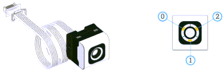

---
mathjax:
  presets: '\def\lr#1#2#3{\left#1#2\right#3}'
---

# Spike kleur sensor

## Uitdaging

***

Opdracht: 

Maak een programma die de waarde van de kleursensor print op de console.

***
***

Opdracht: 

Zorg dat een motor wordt bediend op basis van een kleur. Groen = vooruit, Blauw = achteruit, Rood = stop, Geel = 90° verdraaien in wijzerzin met tussenpauzes (stop) van 1s, Kies zelf nog een ander kleur die hetzelfde doet maar in CCW. Geen kleur = ook stoppen.

Zelfde opdracht, maar nu is geen kleur = de laatste actie verder zetten.

***
***

Opdracht: 

Wat is het verschil tussen color_sensor.reflection(port.C) en  color_sensor.color(port.C)  in werking en in waarde? Welke optie zou je nemen om de rand van een tafel te detecteren? Verklaar je antwoord.

Leer nog meer bij door gebruik te maken van de Kennisbank: Aan de slag en API-modules.

***

