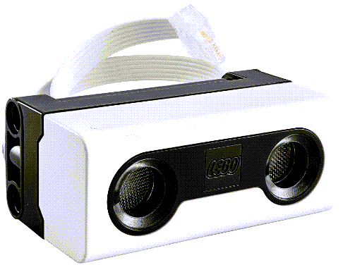

---
mathjax:
  presets: '\def\lr#1#2#3{\left#1#2\right#3}'
---

# Spike afstand sensor

## Uitdaging

***

Opdracht: 

Maak een programma die de waarde van de afstandssensor print op de console. Let wel op: de afstandsensor heeft steeds een korte tijd nodig om een meting uit te voeren en de routine snelheid van de microprocessor ligt vele malen hoger, dus een wacht-tijd van 100ms bij continu metingen is hier op zijn plaats.

In wat wordt de afstand uitgedrukt door de sensor?

Wat is de minimum te meten afstand en de maximum? Met welke waarde komt dit overeen?

***
***

Opdracht: 

Afstand sensor of ultrasoon sensor. Leg uit hoe dit werkt. Hoe snel planten deze golven zich voort in onze atmosfeer? Kan dit ook in de ruimte worden gebruikt?

Welk dier uit de natuur gebruikt ook dit principe om te kijken in het donker?

***
