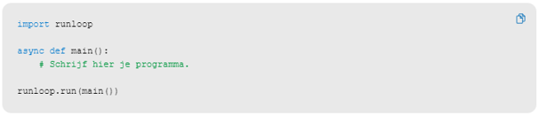
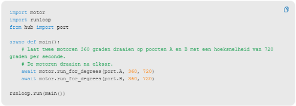

---
mathjax:
  presets: '\def\lr#1#2#3{\left#1#2\right#3}'
---

# Synchroon versus asynchroon

Python instructie kunnen door microcontrollers op twee manieren worden afgehandeld. Dit is zeer belangrijk wanneer de instructies hardware aansturen. Het aansturen van een hardware actuator neemt meestal wat tijd in beslag en is dus vele keren trager dan het werkritme van een microcontroller. Vandaar hier deze opdeling.

## Verduidelijking

Wanneer een actuator (bijvoorbeeld een motor) wordt aangestuurd, kan de functie **synchroon** of **asynchroon** werken.

* **Synchroon:** de functie wacht totdat de actuator zijn opdracht volledig heeft uitgevoerd. Pas daarna wordt de volgende instructie uitgevoerd. Het programma blokkeert dus zolang de beweging bezig is.
* **Asynchroon:** de opdracht wordt gestart, maar het programma wacht niet automatisch op de voltooiing. Met het `await`-statement kan je expliciet aangeven dat het programma moet wachten tot de actuator zijn opdracht heeft afgewerkt voordat de volgende instructie wordt uitgevoerd. 

Bijvoorbeeld:
```python
await motor.run_for_degrees(360, 500)
print("Beweging voltooid")
```
Hier zal `"Beweging voltooid"` pas worden afgedrukt nadat de motor 360° heeft gedraaid.

Laat je het `await`-statement weg (bij een functie die asynchroon is), dan wordt de motor gestart en gaat het programma onmiddellijk verder met de volgende instructie, terwijl de motor nog aan het bewegen is. Hierdoor kunnen meerdere actuatoren gelijktijdig werken of kunnen andere taken ondertussen worden uitgevoerd. Standaard werkt python op die manier.

## Samengevat:


> - **Met** `await`: wacht op het einde van de hardware-actie voordat de volgende instructie wordt uitgevoerd.
> - **Zonder** `await`: de hardware-actie start en het programma voert onmiddellijk de volgende instructie uit. Hierdoor kunnen acties parallel verlopen.





## Uitdaging

***
<div style="background-color:darkgreen; text-align:left; vertical-align:left; padding:15px;">
<p style="color:lightgreen; margin:10px">
Opdracht: 

</p>
<p style="color:white; margin:10px">Zorg dat dit in een oneindige lus gebeurt.</p>
<p style="color:white; margin:10px">Zorg voor wachttijden tussen de overschakeling van motor? De ene motor start dus maar als de vorige gestopt is. Leg uit. is het hier nodig om sleep te gebruiken?</p>
<p style="color:white; margin:10px">Dit is zeer belangrijk dat je de asynchrone werking goed begrijpt!!!!!</p>
</div>

***
