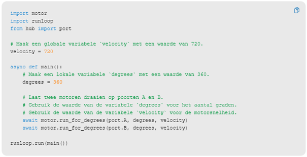
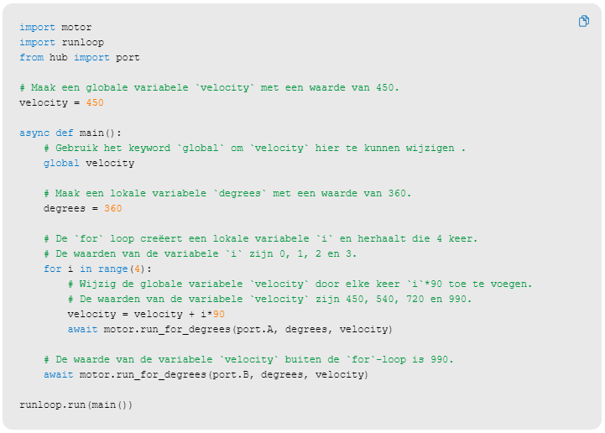

---
mathjax:
  presets: '\def\lr#1#2#3{\left#1#2\right#3}'
---

# Lokale en globale variabelen

Zie de theorie over de scope van variabelen.

## Uitdaging

***

Opdracht: 

Leg uit wat lokale en globale variabelen zijn.

Leg uit wat de scope is van die variabelen.

***
