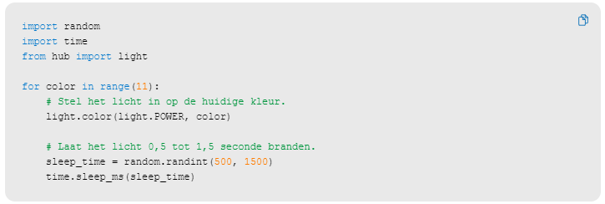

---
mathjax:
  presets: '\def\lr#1#2#3{\left#1#2\right#3}'
---

# Random functie

Zie de theorie over het genereren van random waarden.

## Uitdaging

***

Opdracht: 

Wat is en wat kan de eerste parameter zijn in het statement light.color()? 

Waar is dit kleur te zien op de HUB?

De tweede parameter zorgt voor een kleur. Met welk eenvoudig type variabele kan dit gebeuren? Onderzoek alle waarden van 0-10 => met welk kleur komt dit overeen?

Zoek uit hoe je één LED op de LED-matrix kan aansturen. Leg uit met code en commentaar. Maak een looplicht waarbij 1 LED op de matrix aan de buitenkant rondloopt.

Kunnen de matrix_Leds ook een kleur hebben, helderheid hebben? Hoe?

***
