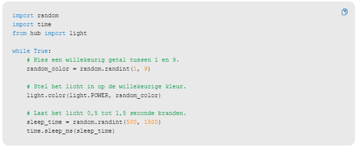
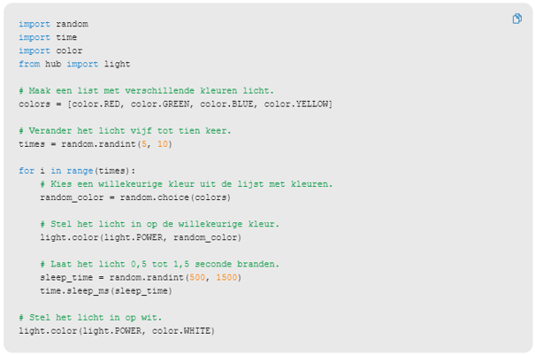

---
mathjax:
  presets: '\def\lr#1#2#3{\left#1#2\right#3}'
---

# Eindeloze loop / beperkte loop

Zie de theorie over herhalingen, ook wel iteraties genoemd.

## Uitdaging

***

Opdracht: 

Wijzig de code zodat er verschillende meerdere kleuren in de list colors staan.

Welk type variabele is color??!!!! Wat is het verschil met een gewone variabele zoals een integer?

***
