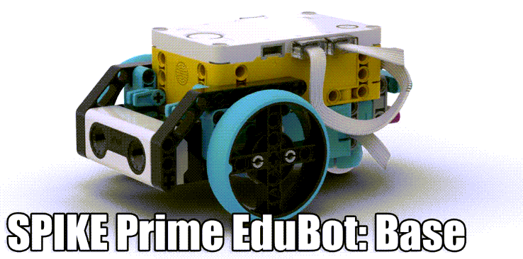
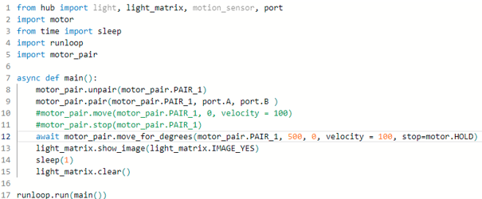

---
mathjax:
  presets: '\def\lr#1#2#3{\left#1#2\right#3}'
---

# EduBot Base

Zie pdf document op Toledo met de bouwinstructies. Maak enkel de EduBot: Base, dit is tem slide 26.

## Uitdaging

***

Realisatie: 

(1) Maak een rijdende robot die vooruit kan rijden zolang de robot in zijn rijrichting niet dichter komt dan 30cm van een obstakel. 

***
***

Realisatie: 

(2) Maak een programma zodat de robot exact 20cm vooruit rijd (aantal rotaties bepalen en diameter van het wiel, 5,6cm??). Trek hiervoor twee lijnen met plakband op de grond met de juiste tussenafstand.

***
***

Realisatie: 

(3) Maak een uitbreiding op het vorige zodat de robot daarna exact een bocht maakt van 90°.(meet de wiel tussenafstand : hoeveel rotaties moet het ene wiel draaien als het andere stilstaat om het voertuig 90° te laten draaien?). Let op: Als je niet ASYNCHROON werkt, dan zal je genoeg SLEEP tijd moeten gebruiken tussen de verschillende stappen om te voorkomen dat de volgende stap al wordt uitgevoerd zonder dat de vorige is afgewerkt!! Een andere oplossing is natuurlijk statements ASYNCHROON  laten uitvoeren. Verklaar.

***

***

Realisatie: 

(4) Maak een uitbreiding op vorige zodat de robot een vierkant kan rijden.

***

## Motorpaar

Soms kan het interessant zijn om de motoren per paar aan te sturen om een voertuig te laten rijden.

Dit kan zo:

## Uitdaging

***

Opdracht: 

Wat is de steering parameter? Wat zijn de waarden die je hieraan kan geven? Wat is het rijgedrag van het voertuig nu? Test hier veel waarden uit en trek je conclusie.

***