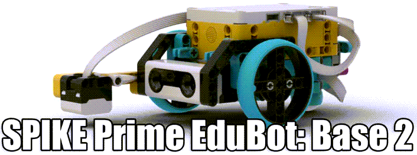

---
mathjax:
  presets: '\def\lr#1#2#3{\left#1#2\right#3}'
---

# EduBot Base2

Zie pdf document op Toledo met de bouwinstructies. Bouw verder de EduBot: Base2, dit is tem slide 37.

## Uitdaging

***

Realisatie: 

(5) Maak een programma waarbij de robot vooruit kan rijden tot de rand van de tafel. Bij detectie rand, stopt de robot en maakt een haakse (90°) bocht achteruit en rijdt dan nadien terug verder vooruit tot de volgende rand … (blijft dit herhalen).

***
***

Realisatie: 

(6) Maak een programma van vorig puntje met uitbreiding van een detectie (op 10cm) vooruit. Bij detectie stopt de robot met rijden en toont een figuur op de Light_matrix. Van het moment er geen detectie meer is, verdwijnt de afbeelding en doet de robot gewoon verder met zijn rijprogramma.

***
***

Realisatie: 

(7) Uitbreiding van vorige: zorg dat de robot maar start als er op de druksensor (monteer die zelf) wordt gedrukt en loslaten. 

***

