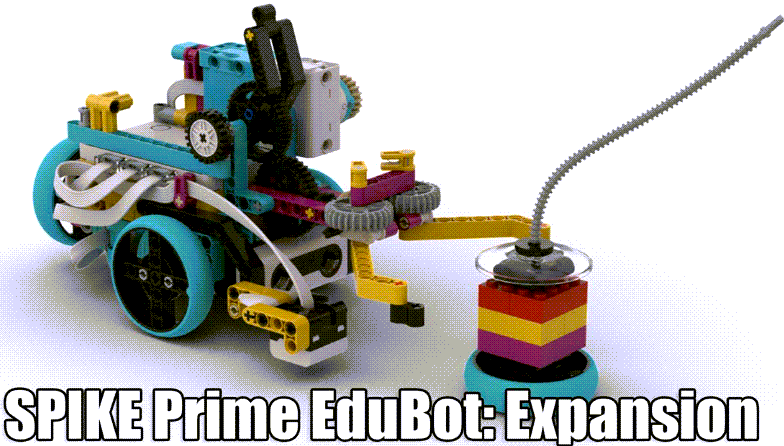

---
mathjax:
  presets: '\def\lr#1#2#3{\left#1#2\right#3}'
---

# EduBot Expansion

Zie pdf document op Toledo met de bouwinstructies. Bouw verder de EduBot: Expansion.

## Uitdaging

***

Realisatie: 

(8) Maak een Pick&DropBot programma: zoek eerst de werking uit van de grijper in een apart programma. Eenmaal je dat onder de knie hebt, integreer dit dan in vorige programma’s zodat alles werkt. Zorg voor perfect 90° bochten. Neem alle berekeningen en schetsen hiervan op in uw verslag.

***
