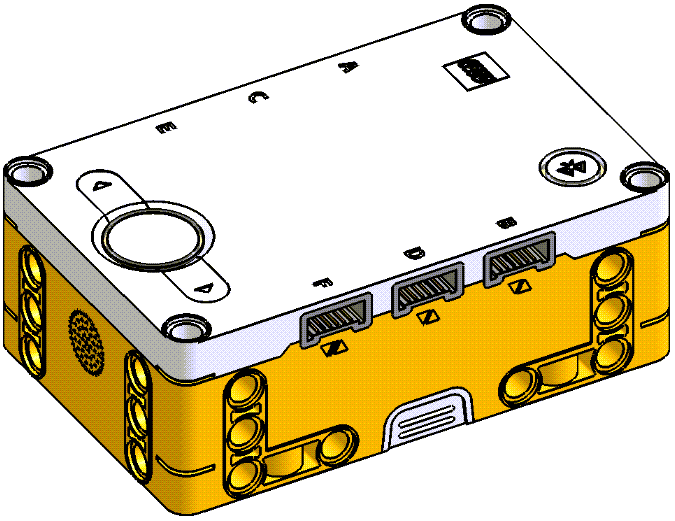
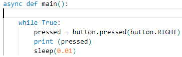
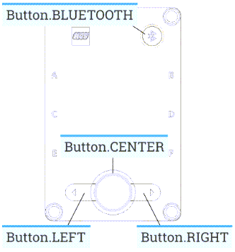
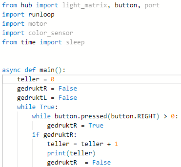

---
mathjax:
  presets: '\def\lr#1#2#3{\left#1#2\right#3}'
---

# LEGO Spike Prime Hub

De Hub zelf bezit nog enkele sensoren. Zo zijn de drukknoppen op de Hub ook wel sensoren. Je kan software matig nagaan of die worden ingedrukt. 

Verder bezit de Hub ook een Gyro sensor. Zoek zelf op wat een Gyro sensor is. Wat doet het? Wat meet de sensor? Hoe werkt die?

De drukknoppen op de HUB kunnen worden ingelezen.
Onderzoek op welke manier de toestand van de drukknoppen kan worden gelezen in Python.
Vertrek van deze code.

## Uitdaging

***

Opdracht: 

Bestudeer het resultaat door de drukknop eens in te drukken en terug los te laten. Wat zijn de bevindingen? Doe dit eens kort en doe dit eens lang.

***

***

Opdracht: 

Op welke manier zou je een enkelvoudige druk op de knop maken? Maak een teller en print de waarde van de teller die optelt telkens je eens op de drukknop hebt gedrukt en losgelaten (dus een enkelvoudige druk)

***

***

Realisatie: 

(9) Maak op- en af-teller met de knoppen R & L en print de waarde van de teller op de console.

***

***

Realisatie: 

(10) Maak een opteller (enkel met de R-toets) en zorg dat er bij iedere tiende klik een figuurtje te voorschijn komt, bij de klikken daartussen is steeds een andere figuur te zien.

***
