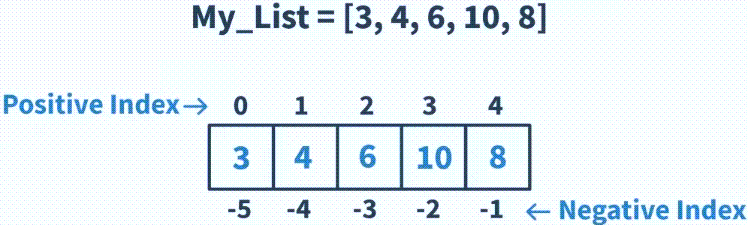

---
mathjax:
  presets: '\def\lr#1#2#3{\left#1#2\right#3}'
---

# Lijsten – Array

Zie cursus theorie wat een `list` is. Andere benamingen hiervoor zijn `array` of `lijsten`. Bestudeer opnieuw de werking hiervan. Hoe declareer je dit? Wat kan dit bevatten? Wat is het verschil met een gewone variabele? ...

## Uitdaging

***

Realisatie: 

(11) Met de kennis van de knoppen zal je nu een lijst van 5 kleurblokjes inlezen in een array. Door telkens een kleurblokje voor de kleursensor te houden en op de R-knop te drukken (bevestiging) wordt die kleur opgeslagen in het volgende vrije element in de array. Zo worden vijf kleuren opgeslagen. Geef telkens een korte bevestiging door een hele korte beep. Geef een langere beep als de vijf kleuren allemaal zijn opgeslagen.

•	Print nadat de array is opgevuld het volledige array op de console. Volgende kleuren mogen niet geaccepteerd worden: geen kleur, wit en zwart en het moeten allemaal unieke kleuren zijn, dus twee of meer dezelfde kleuren mogen niet toegelaten worden (controle dus).

***

***

Realisatie: 

(12) Maak een Mastermind-game.

Geef opgave in: Toon 5 kleurblokjes (unieke, geen wit, geen zwart en ook geen geen kleur) Sla de opeenvolgende kleuren (nummers) op in een array (telkens bevestiging met knop) .

Laat een speler daarna 3 pogingen ondernemen om de volgorde te achterhalen. Bij iedere poging toont de hub op een horizontale lijn wat er juist was (juiste kleur op de juiste plaat)

Bij winst, toon een blij gezicht

Bij verlies, toon een triestig gezicht

Gebruik een zelfde methode om twee array’s op te vullen (opgave met juiste kleurcombinatie en probeer versie om de kleurcombinaties te achterhalen)

***
